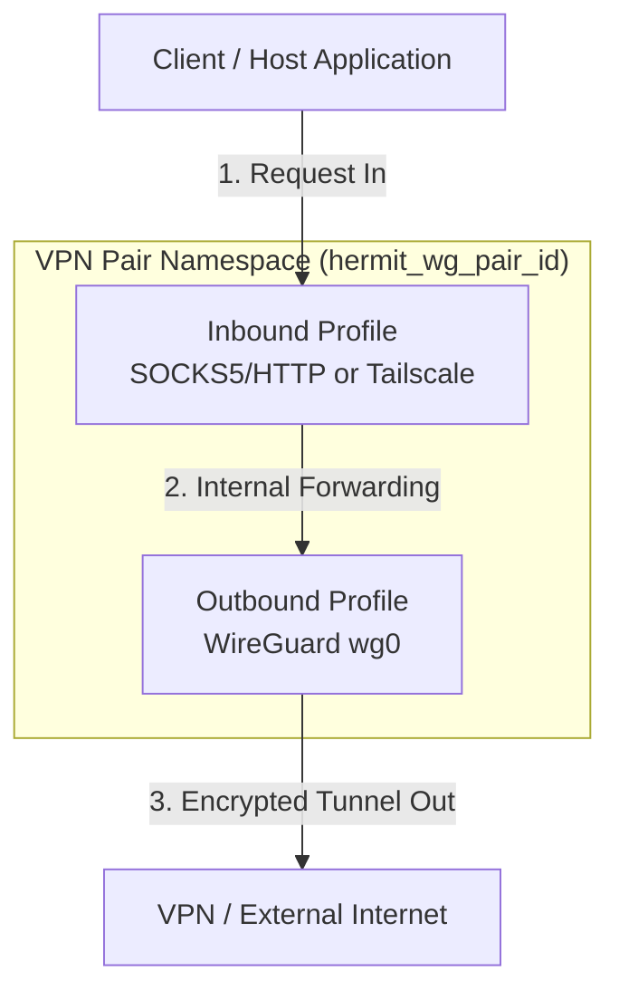

# Hermit

Hermit is a modular multi-tunnel orchestrator and manager for VPN connection pairs running inside isolated network namespaces (`netns`). It decouples configurations into reusable **Inbound Profiles** (e.g., SOCKS5/HTTP Proxy, Tailscale) and **Outbound Profiles** (e.g., WireGuard), allowing you to easily pair, share configurations, and manage multiple tunnels side-by-side.

The application provides a real-time web dashboard to monitor bandwidth usage, manage connection states, create and share profiles, and configure global settings.

> ⚠️ **IMPORTANT NOTE**: This project requires elevated system privileges (`privileged: true`) and advanced networking tools such as `iptables`, `iproute2`, `wireguard-tools`, and `tailscale`. To avoid impacting your host machine's network configuration and to ensure a consistent development environment, **it is highly recommended to develop and run this project completely within Docker**.

---

## Architecture & Network Flow

Hermit uses a decoupled architecture where a VPN tunnel (VPN Pair) is created by combining an **Inbound Profile** with an **Outbound Profile**. The architecture splits system operations into two separate, coordinated planes: the **Traffic Plane** (for normal internet data) and the **DNS Control Plane** (for name resolution and dynamic filtering).

### 1. Traffic Plane (General Data Flow)
This plane manages the encapsulation and transport of regular network traffic (HTTP, TCP/UDP streams) through isolated namespaces.



* **Inbound Profiles**: Define how traffic enters the isolated namespace.
  * **SOCKS5/HTTP Proxy**: Spawns dual proxy daemons (`microsocks` SOCKS5 on 1080, `tinyproxy` HTTP on 8080) inside the namespace, multiplexed via a host-level relayer.
  * **Tailscale**: Binds the namespace to your Tailscale network (tailnet) as an active node.
* **Outbound Profiles**: Define how traffic exits the namespace.
  * **WireGuard**: Interfaces are isolated inside the namespace (`wg0`) to route all outbound data through WireGuard.
* **VPN Pairs**: The orchestrator ties these components together into a single running instance, preventing resource conflicts automatically.

---

### 2. DNS Control Plane (Resolution & Filtering)
This plane is completely decoupled from the VPN Pairs. It manages name resolution, caching, and blocklist filtering through dedicated DNS Nodes tied to each **Inbound Profile** (specifically Tailscale profiles), avoiding the overhead of running a local resolver inside every single tunnel.

When DNS Filtering is enabled for an Inbound Profile, Hermit provisions a dedicated DNS namespace (`hermit_dns_{profile_id}`) running `tailscaled` as an active Tailscale node. When Tailscale DNS Override is enabled, the node's Tailscale IP is registered tailnet-wide via the Tailscale API, causing all DNS queries from any device on the tailnet to route automatically to it.

```mermaid
flowchart TD
    Client[Any Tailnet Device] -->|1. DNS Query over Tailnet| tailscaled
    
    subgraph DNS_NS["DNS Namespace (hermit_dns_profile_id)"]
        tailscaled["tailscaled<br>(Tailscale Node + MagicDNS)"]
        tailscaled -->|2. Kernel routes port 53| DNAT["iptables PREROUTING DNAT<br>UDP/TCP :53 -> 10.251.{id}.1:{5400+id}"]
    end
    
    subgraph Host["Host Plane (Container)"]
        DNAT -->|3. Forwarded via veth<br>dns_h_{id} / eth0| Elixir_DNS["Elixir DNS Server<br>(bind 10.251.{id}.1, port 5400 + id)"]
        
        %% Fast Path
        Elixir_DNS -->|"Fast Path: Custom Rules /<br>Blocked / Cached"| Fast_Return["Instant Response (0-1 ms)"]
        
        %% Slow Path
        Elixir_DNS -->|Slow Path: Cache Miss| Upstream["Upstream DNS / DoH"]
        Elixir_DNS -->|"Slow Path: *.ts.net query<br>to 100.100.100.100"| Policy_Route["Host Policy Routing<br>(ip rule table {1000+id})"]
    end

    Policy_Route -->|"4. Route back via veth<br>into namespace"| tailscaled
    tailscaled -->|5. Resolve via MagicDNS| MagicDNS["Tailscale MagicDNS Network"]
    
    Fast_Return -->|Resolve immediately| Client
    Upstream -->|6. Cache & Return| Elixir_DNS
    MagicDNS -->|6. Cache & Return| Elixir_DNS
```

* **Tailscale Entry Point**: `tailscaled` inside the DNS namespace acts as the Tailscale network endpoint. DNS queries from any tailnet device arrive at `tailscaled`, which delivers them into the namespace's network stack. The kernel then hits `iptables PREROUTING DNAT` rules that redirect all UDP/TCP port 53 traffic to the Elixir DNS Server on the host via the virtual `veth` pair (`dns_h_{id}` on host side, `eth0` inside namespace).
* **Profile-Specific Filtering (Fast Path vs. Slow Path)**: The Elixir DNS Server on the host (bound to `10.251.{profile_id}.1` on port `5400 + profile_id`) evaluates each query in order:
  1. **Custom Rules**: Matched first. Domains matching a custom `block` rule get an immediate NXDOMAIN; domains matching a `redirect` rule get the configured IP.
  2. **Blocklists**: If no custom rule matched, the query is checked against AdGuard, GoodbyeAds, and adult content blocklists loaded into ETS. Matched domains get NXDOMAIN.
  3. **Cache**: If the query is not blocked, the shared ETS cache is checked. A cache hit returns the stored response immediately.
  4. Steps 1-3 are the **Fast Path** (0-1 ms, no external network access). A cache miss proceeds to the **Slow Path** (upstream forwarding).
* **Upstream Forwarding & MagicDNS**: On a cache miss, the server selects upstreams based on the domain:
  * Standard queries are forwarded to configured upstream DNS servers (UDP) or DNS-over-HTTPS (DoH) endpoints. The server probes all upstreams periodically and prefers the lowest-latency one.
  * Queries for Tailscale internal domains (`*.ts.net`, `*.tailscale.net`) are forwarded to the Tailscale nameserver `100.100.100.100`. Source-based policy routing on the host (`ip rule from 10.251.{id}.1 to 100.64.0.0/10 table {1000+id}`) routes these packets back through the veth into the DNS namespace, where `tailscaled` resolves them via MagicDNS. The response follows the same path in reverse.

---

## How Traffic and DNS Planes Connect

When you run a VPN Pair, its network namespace is configured as follows:

| Connection Feature | Plane / Mechanism | Network Route |
| :--- | :--- | :--- |
| **Web & API Traffic** | Traffic Plane | Routed directly through the outbound WireGuard (`wg0`) interface. |
| **DNS Queries** | DNS Control Plane | Resolved according to the VPN Pair's configuration: either routed over the Tailnet to the profile's dedicated DNS Node (when using Tailscale DNS integration) or resolved via custom DNS resolvers. |

---

## System Requirements

- **Docker** and **Docker Compose**
- There is no need to install Elixir, Erlang, or SQLite on your host machine as all runtime dependencies are packaged and configured automatically inside the container.

---

## Installation & Quick Start with Docker

To set up the database, fetch dependencies, compile assets, and launch the application, run a single command:

```bash
docker compose up --build
```

Once the container has successfully started, you can access the web interface at:
👉 **[http://localhost:3000](http://localhost:3000)**

Config files and data for your VPN tunnels will persist in the `./storage` directory on your host machine via volume mounts.

### Customizing the Web Port

By default, the dashboard runs on port `3000`. If you need to run it on a different port on your host machine, you can set the `HERMIT_PORT` environment variable before running Docker Compose:

```bash
HERMIT_PORT=8080 docker compose up --build
```

This will map port `8080` on your host machine to port `3000` inside the container, making the dashboard accessible at `http://localhost:8080`.

### Running in Bridge Mode (Recommended for Host Isolation)

By default, the docker-compose configuration uses `network_mode: host` to simplify routing. However, if you want to run Hermit in an isolated Docker network (Bridge Mode) to protect the host's iptables and network interfaces:

1. Remove `network_mode: host` from your `docker-compose.yml`.
2. Add the following `ports` mapping to allow incoming web, proxy, and DNS traffic:

```yaml
    ports:
      - "3000:3000"
      - "10000-10199:10000-10199"       # Mapped range for dynamic SOCKS5/HTTP proxies
      - "5400-5500:5400-5500/udp"       # Mapped range for dynamic DNS servers
```

Hermit will automatically allocate dynamic SOCKS5/HTTP proxies inside the range `10000 - 10199` and dynamic DNS nodes inside the range `5400 - 5500`, ensuring they map correctly to the host without any risk of host network configuration contamination.

---

## Development & Testing inside Docker

When developing Hermit, it is recommended to run mix tasks and test suites directly inside the container to ensure correct behavior:

### 1. Run Precommit Checks
Before committing code, run the comprehensive precommit pipeline to format code, check for compiler warnings, and run tests:
```bash
docker compose exec hermit mix precommit
```

### 2. Run Test Suite
To run the project's tests:
```bash
docker compose exec hermit mix test
```

### 3. Fetch Dependencies
If you make changes to `mix.exs`, fetch the updated dependencies within the container:
```bash
docker compose exec hermit mix deps.get
```

---

## Why Docker?

Running real-world VPN pairs requires operating-system level root privileges to create network namespaces (`netns`), configure virtual network interfaces, and route traffic via `iptables`.
- The **`privileged: true`** setting in `docker-compose.yml` grants the container permissions to perform these system-level operations in an isolated manner.
- Running directly on your host machine risks messing up local network interfaces and requires granting global `sudo` privileges to external scripts, which is unsafe for your development environment.

---

## 🗺️ Alternatives & Similar Projects

If you are looking for other tools to manage VPNs or WireGuard tunnels, here is how **Hermit** compares to existing popular open-source alternatives:

| Project | Primary Focus | UI Type | WireGuard Management | Tailscale Integration | Network Namespace Isolation |
| :--- | :--- | :--- | :--- | :--- | :--- |
| **Hermit** | Multi-tunnel orchestrator | Web Dashboard | Yes | Yes | Yes (isolated `netns`) |
| **[wireproxy](https://github.com/octeep/wireproxy)** | Userspace WireGuard proxy | CLI / Config | Yes | No | No (userspace proxy) |
| **[Gluetun](https://github.com/qdm12/gluetun)** | Docker-focused VPN client | CLI / Config | Yes | No | No (uses Docker network links) |

---

## 🤝 Contributing

Contributions are welcome! Please feel free to open issues, submit pull requests, or share ideas to improve Hermit.

---

## 📄 License

This project is licensed under the MIT License - see the [LICENSE](LICENSE) file for details.
