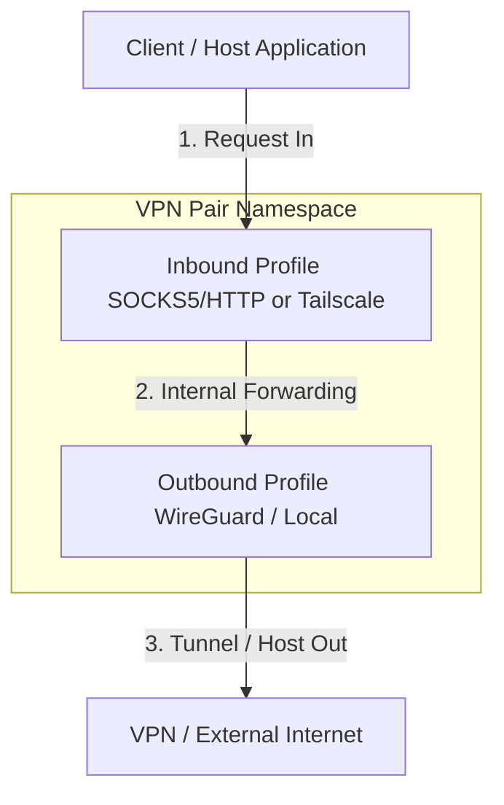
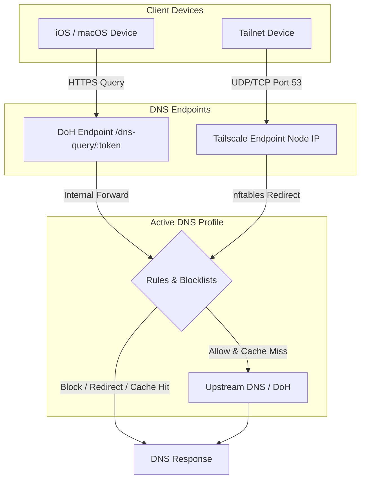

<h1 align="center">
   Hermit
</h1>

<p align="center">
  A modular multi-tunnel orchestrator and manager for VPN connection pairs running inside isolated network namespaces (<code>netns</code>).
</p>

<p align="center">
  <a href="https://github.com/quaywin/hermit/blob/main/LICENSE"></a>
  <a href="https://elixir-lang.org"></a>
  <a href="https://phoenixframework.org"></a>
</p>

---

Hermit is a modular multi-tunnel orchestrator and manager for VPN connection pairs running inside isolated network namespaces (`netns`). It decouples configurations into reusable **Inbound Profiles** (e.g., SOCKS5/HTTP Proxy, Tailscale) and **Outbound Profiles** (e.g., WireGuard, Local), allowing you to easily pair, share configurations, and manage multiple tunnels side-by-side.

The application provides a real-time web dashboard to monitor bandwidth usage, manage connection states, create and share profiles, and configure global settings.

> [!IMPORTANT]
> This project requires elevated system privileges (`privileged: true`) and advanced networking tools such as `nftables`, `iproute2`, `wireguard-tools`, and `tailscale`. To avoid impacting your host machine's network configuration and to ensure a consistent development environment, **it is highly recommended to develop and run this project completely within Docker**.

---

## Key Features

- **Multi-Tunnel Orchestration**: Pair inbound (SOCKS5/HTTP Proxy, Tailscale) with outbound (WireGuard, Local) profiles to run multiple independent tunnels side-by-side.
- **Isolated Network Namespaces**: Run each connection pair in its own Linux network namespace (`netns`) with dynamic source-policy routing to prevent routing conflicts.
- **Decoupled DNS Control Plane**: A DNS filtering system with bloom filters, caching, dynamic blocklist loading (AdGuard, GoodbyeAds, adult content), and custom DNS routing rules (Block, Bypass, Redirect, Forward Proxy, Forward DNS).
- **DNS Endpoints (DoH / VPN Nodes)**: Expose secure DNS-over-HTTPS (DoH) endpoints with auto-generated Apple Configuration Profiles (`.mobileconfig`) or dedicated Tailscale DNS Nodes.
- **Tailscale DNS Override**: Automatically registers local DNS Nodes as tailnet-wide nameservers.
- **EDNS Client Subnet (ECS)**: Forward client subnet masks to public upstreams (e.g. Google DNS) to optimize CDN routing, with support for LAN privacy filtering and custom fallback IPs.
- **VPN Providers Integration**: Direct authentication with NordVPN (using Access Tokens) and Mullvad to fetch recommendations, network speed profiles, and public keys.
- **Real-Time Web Dashboard**: A Phoenix LiveView dashboard to monitor bandwidth, manage tunnel states, view query logs, and edit configurations on the fly.

---

## Architecture & Network Flow

Hermit creates VPN tunnels by combining an **Inbound Profile** with an **Outbound Profile** inside an isolated Linux network namespace. The architecture is split into two planes:

- **Traffic Plane**: Carries regular network data (HTTP, TCP/UDP) through the tunnel.
- **DNS Control Plane**: Handles name resolution, caching, and ad/tracker filtering independently from the tunnels.

### Traffic Plane



- **Inbound Profiles** define how traffic enters the namespace:
  - **SOCKS5/HTTP Proxy**: Exposes SOCKS5 and HTTP proxy endpoints for clients to connect to.
  - **Tailscale**: Joins the namespace to your Tailscale network (tailnet) as a node, allowing any tailnet device to route traffic through it.
- **Outbound Profiles** define how traffic exits the namespace:
  - **WireGuard**: All outbound traffic is routed through a WireGuard tunnel.
  - **Local**: Bypasses VPN tunnels and routes traffic directly through the host network interface (useful for testing, local proxies, or selective routing).
- **VPN Pairs**: The orchestrator combines one Inbound + one Outbound into a running instance, handling resource allocation and conflict prevention automatically.

### DNS Control Plane

The DNS plane is fully decoupled from VPN Pairs and Inbound Networks. Hermit supports **DNS Endpoints** and **DNS Profiles** to separate network connection endpoints from routing/filtering logic:

- **DNS Profiles**: Pre-configure multiple DNS Profiles, each with its own upstream DNS servers (UDP/DoH), custom routing rules (block/bypass/redirect), and toggleable blocklists.
- **DNS Endpoints (DoH / VPN Nodes)**: Expose access points for your devices. You can create multiple Endpoints:
  - **DoH Only (Default / Lightweight)**: Runs entirely in-memory using the Phoenix HTTP/HTTPS web port, using 0% extra CPU/RAM. Provides a secure HTTPS DoH URL (`/dns-query/:token`) and automatically generates signed Apple configuration profiles (`.mobileconfig`).
  - **Tailscale Integration (Optional)**: Link your DNS Endpoint to any Tailscale Inbound Profile. When active, Hermit boots a dedicated **DNS Node** (`tailscaled` inside a network namespace `hermit_dns_endpoint_#{id}`) on your tailnet, allowing client devices to resolve DNS over UDP/TCP 53.
- **Automated Global DNS Configuration**: When **Tailscale DNS Override** is enabled on a Tailscale Endpoint, Hermit registers the local DNS Node IP as the global nameserver for your entire tailnet. All devices on your tailnet will use this node automatically without manual client configuration.



When a DNS query arrives, the server evaluates it through a **fast path** before reaching the network:

1. **Custom Rules**: User-defined routing rules are matched first. Actions include:
   - **Block**: Instantly block matching domains (NXDOMAIN).
   - **Bypass**: Bypass ad/tracker blocklist filters.
   - **Redirect**: Resolve domain to a specific target IP address (A record).
   - **Forward Proxy**: Proxy the DNS query through the proxy tunnel of a selected VPN pair.
   - **Forward DNS**: Forward the DNS query to a specific DNS Server (UDP/DoH), optionally routed through the SOCKS5/HTTP proxy of a selected VPN pair.
2. **Blocklists**: Checked against built-in ad/tracker blocklists (AdGuard, GoodbyeAds, adult content). Matched domains are blocked instantly.
3. **Cache**: Previously resolved queries are returned from cache.

If none of the above match (cache miss), the query is forwarded to configured **upstream DNS servers** (UDP or DoH).

### DNS-over-HTTPS (DoH) & Apple Device Provisioning

In addition to Tailscale integration, Hermit includes a built-in **DNS-over-HTTPS (DoH)** server. This allows any device (even those not on your Tailnet) to use your secure, filtered DNS configurations.
- **Secure DoH Endpoint**: Each DNS Endpoint is assigned a unique token, exposing a secure DoH resolver endpoint at `https://<your-host>/dns-query/<doh_token>`.
- **Apple Configuration Profiles (`.mobileconfig`)**: Hermit can dynamically generate Apple configuration profiles for iOS and macOS. Users can download these profiles from the dashboard to configure system-wide secure DNS with zero manual setup. All profile descriptions match your custom Endpoint names.

### EDNS Client Subnet (ECS) & Subnet Spoofing

Hermit supports **EDNS Client Subnet (ECS, RFC 7871)** to optimize CDN routing (e.g. YouTube, Netflix, Facebook) by forwarding the client's subnet mask (IPv4 `/24` or IPv6 `/48`) to public upstream DNS servers.
- **Smart Client Subnet Forwarding**: For public client IPs (e.g. via DoH), Hermit forwards the subnet directly. For private client IPs (e.g. loopback, LAN, or Tailscale CGNAT `100.64.0.0/10`), Hermit skips ECS injection automatically to protect client privacy.
- **ECS Fallback IP**: You can configure a public IP address as the fallback. When a request originates from a private Tailscale IP, Hermit will inject the fallback IP subnet instead, ensuring you always resolve CDN traffic to your target country.

---

## VPN Provider Integration

To simplify creating Outbound Profiles, Hermit provides a dedicated **Providers** page (`/providers`) that integrates with popular commercial VPN providers:
- **NordVPN**: Authenticate using a NordVPN Access Token to retrieve your private key, list recommended countries, and import recommended WireGuard server configurations.
- **Mullvad**: Fetch active Mullvad WireGuard servers with country/city metadata, network speeds, and public keys.
- **Custom Imports**: Easily upload or paste custom WireGuard configuration files to generate new Outbound Profiles in one click.

---

## System Requirements

- **Docker** and **Docker Compose**

> [!NOTE]
> There is no need to install Elixir, Erlang, or SQLite on your host machine as all runtime dependencies are packaged and configured automatically inside the container.

---

## Installation & Quick Start with Docker

Hermit can be run in two different modes:

### 1. Production Mode (No Clone Required)

```bash
curl -L https://raw.githubusercontent.com/quaywin/hermit/main/docker-compose.yml -o docker-compose.yml
docker compose pull && docker compose up -d
```

If you have already cloned the repository, run `docker compose up -d --build` instead.

Once started, access the dashboard at **http://localhost:3000**.

### 2. Development Mode

Mounts the source code directory directly, enabling incremental compilation and hot-code reloading. You do not need to rebuild the Docker image when editing files.

```bash
docker compose -f docker-compose.dev.yml up -d
```

> [!TIP]
> Modifying source code on the host machine instantly triggers incremental compilation in less than 0.5 seconds. Subsequent starts are nearly instantaneous because dependency compilation and build artifacts are cached.

### Customizing the Web Port

By default, the dashboard runs on port `3000`. To use a different port, set `HERMIT_PORT`:

```bash
# Production
HERMIT_PORT=8080 docker compose up -d

# Development
HERMIT_PORT=8080 docker compose -f docker-compose.dev.yml up -d
```

### Enforcing Web Dashboard Authentication (Basic Auth)

By default, the web dashboard has no authentication enabled. If you are deploying Hermit on a public VPS or a shared network, you can enforce Basic Authentication by setting the following environment variables in your `.env` file:

```bash
HERMIT_BASIC_AUTH_USER=admin
HERMIT_BASIC_AUTH_PASS=your_secure_password
```

> [!WARNING]
> If these environment variables are unset or commented out, authentication will be bypassed and the dashboard will be open to anyone.

### Tailscale UDP Port & VPS Firewall Configuration

By default, Hermit binds port `41642/udp` on the host machine (mapped to `41641/udp` inside the container). This avoids conflicts with any Tailscale daemon running directly on your host machine, which typically uses port `41641/udp`.

If you are deploying Hermit on a VPS:
- **Recommended**: Open port `41642/udp` in your VPS firewall to allow Tailscale to establish direct, peer-to-peer (P2P) connections, ensuring optimal speed and the lowest latency.

If you need to change this port to a different one (e.g., `41643`):
1. Open `docker-compose.yml` (and/or `docker-compose.dev.yml`).
2. Change the host-side port mapping:
   ```yaml
   ports:
     - "${HERMIT_PORT:-3000}:3000"
     - "41643:41641/udp"
   ```
3. Open the corresponding port on your firewall instead.

---

## Why Docker?

Running real-world VPN pairs requires operating-system level root privileges to create network namespaces (`netns`), configure virtual network interfaces, and route traffic via `nftables`.
- The **`privileged: true`** setting in `docker-compose.yml` grants the container permissions to perform these system-level operations in an isolated manner.
- Running directly on your host machine risks messing up local network interfaces and requires granting global `sudo` privileges to external scripts, which is unsafe for your development environment.

---

## Future Roadmap

We aim to continuously improve Hermit. Planned future enhancements include:
- **Expanded VPN Provider Integration**: Add support for more commercial VPN providers (such as Surfshark, ProtonVPN, and ExpressVPN) to fetch keys, server recommendations, and network speed profiles automatically.
- **Alternative Inbound Mesh Networks**: Integrate additional Tailscale-like overlay networks (e.g., **ZeroTier**, **Netmaker**, **Headscale**, or **Nebula**) as Inbound Profiles, allowing client devices on those networks to route traffic through your outbound tunnels.

---

## Alternatives & Similar Projects

If you are looking for other tools to manage VPNs or WireGuard tunnels, here is how **Hermit** compares to existing popular open-source alternatives:

| Project | Primary Focus | UI Type | WireGuard Management | Tailscale Integration | Network Namespace Isolation |
| :--- | :--- | :--- | :--- | :--- | :--- |
| **Hermit** | Multi-tunnel orchestrator | Web Dashboard | Yes | Yes | Yes (isolated `netns`) |
| **[wireproxy](https://github.com/octeep/wireproxy)** | Userspace WireGuard proxy | CLI / Config | Yes | No | No (userspace proxy) |
| **[Gluetun](https://github.com/qdm12/gluetun)** | Docker-focused VPN client | CLI / Config | Yes | No | No (uses Docker network links) |
