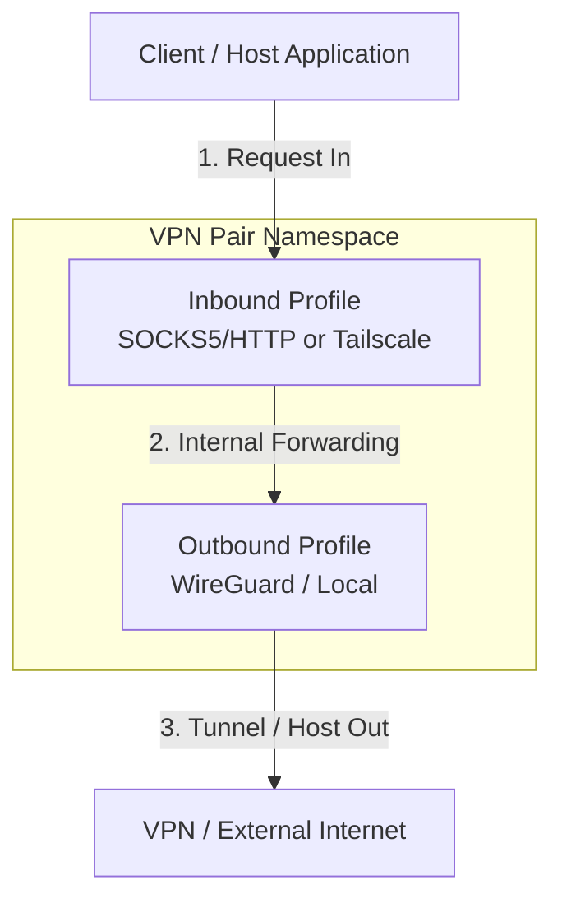
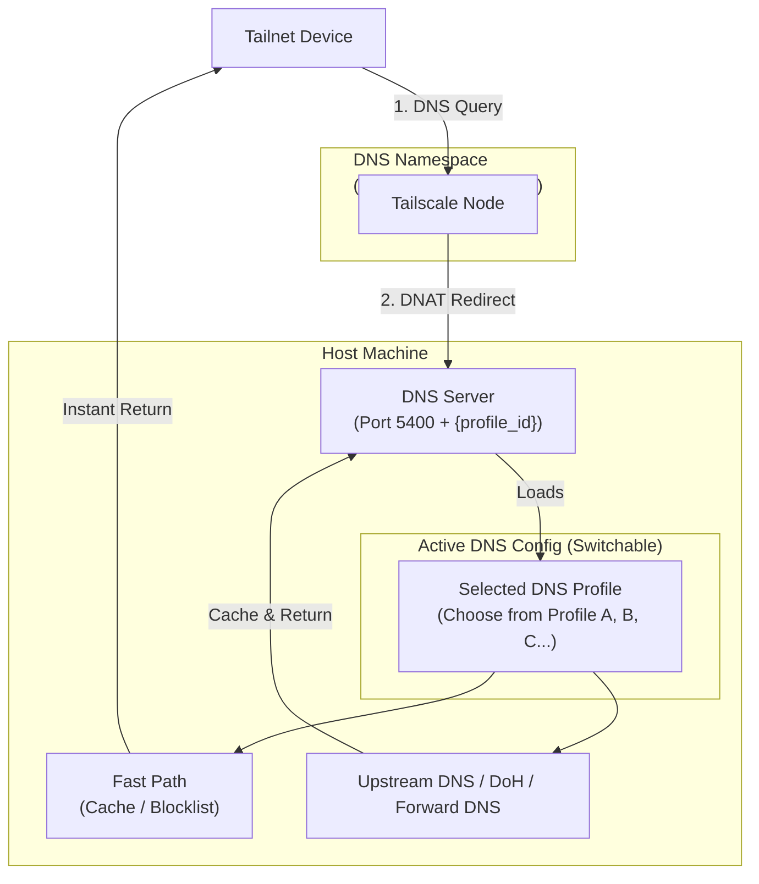

# Hermit

Hermit is a modular multi-tunnel orchestrator and manager for VPN connection pairs running inside isolated network namespaces (`netns`). It decouples configurations into reusable **Inbound Profiles** (e.g., SOCKS5/HTTP Proxy, Tailscale) and **Outbound Profiles** (e.g., WireGuard, Local), allowing you to easily pair, share configurations, and manage multiple tunnels side-by-side.

The application provides a real-time web dashboard to monitor bandwidth usage, manage connection states, create and share profiles, and configure global settings.

> ⚠️ **IMPORTANT NOTE**: This project requires elevated system privileges (`privileged: true`) and advanced networking tools such as `iptables`, `iproute2`, `wireguard-tools`, and `tailscale`. To avoid impacting your host machine's network configuration and to ensure a consistent development environment, **it is highly recommended to develop and run this project completely within Docker**.

---

## Architecture & Network Flow

Hermit creates VPN tunnels by combining an **Inbound Profile** with an **Outbound Profile** inside an isolated Linux network namespace. The architecture is split into two planes:

- **Traffic Plane**: Carries regular network data (HTTP, TCP/UDP) through the tunnel.
- **DNS Control Plane**: Handles name resolution, caching, and ad/tracker filtering independently from the tunnels.

### Traffic Plane



- **Inbound Profiles** define how traffic enters the namespace:
  - **SOCKS5/HTTP Proxy**: Exposes a SOCKS5 and HTTP proxy endpoint for clients to connect to.
  - **Tailscale**: Joins the namespace to your Tailscale network (tailnet) as a node, so any tailnet device can route traffic through it.
- **Outbound Profiles** define how traffic exits the namespace:
  - **WireGuard**: All outbound traffic is routed through a WireGuard tunnel.
  - **Local**: Bypasses VPN tunnels and routes traffic directly through the host network interface. This is useful for testing, local proxies, or selective routing without a VPN.
- **VPN Pairs**: The orchestrator combines one Inbound + one Outbound into a running instance, handling resource allocation and conflict prevention automatically.

### DNS Control Plane

The DNS plane is decoupled from VPN Pairs. Hermit supports **Multi-Profile Dynamic DNS Filtering**, allowing you to pre-configure multiple DNS Server Profiles and assign them dynamically to your Inbound Profiles.

- **Multiple Pre-configured DNS Profiles**: Set up multiple DNS Profiles beforehand, each with its own upstream DNS servers (UDP/DoH), custom routing rules (block/bypass/redirect), and toggleable blocklists.
- **Dynamic & Easy Switching**: A single Tailscale Inbound Profile can be easily linked to and switched between any of the pre-configured DNS Profiles on the fly. Switching profiles updates the DNS filters and upstream servers instantly without interrupting the main Tailscale connection.
- **Automated Node Setup**: When a Tailscale Inbound Profile starts, Hermit automatically provisions and boots a dedicated **DNS Node** (running `tailscaled` in an isolated network namespace `hermit_dns_#{profile_id}`) and its associated Elixir DNS resolver.
- **Automated Global DNS Configuration**: When **Tailscale DNS Override** is enabled, Hermit automatically uses the Tailscale API to register this DNS Node as the global nameserver for your entire tailnet. All devices on your tailnet will use this node automatically without any manual client configuration.



When a DNS query arrives, the server evaluates it through a **fast path** before reaching the network:

1. **Custom Rules**: User-defined routing rules are matched first. Actions include:
   - **Block**: Instantly block matching domains (NXDOMAIN).
   - **Bypass**: Bypass ad/tracker blocklist filters.
   - **Redirect**: Resolve domain to a specific target IP address (A record).
   - **Forward Proxy**: Proxy the DNS query through the proxy tunnel of a selected VPN pair.
   - **Forward DNS**: Forward the DNS query to a specific DNS Server (UDP/DoH), optionally routed through the SOCKS5/HTTP proxy of a selected VPN pair (useful for resolving corporate/private networks or Tailscale MagicDNS).
2. **Blocklists**: Checked against built-in ad/tracker blocklists (AdGuard, GoodbyeAds, adult content). Matched domains are blocked instantly.
3. **Cache**: Previously resolved queries are returned from cache.

If none of the above match (cache miss), the query is forwarded to configured **upstream DNS servers** (UDP or DoH).

When **Tailscale DNS Override** is enabled, the DNS Node registers itself as the tailnet-wide DNS server via the Tailscale API, so all devices on the tailnet use it automatically without manual configuration.

### DNS-over-HTTPS (DoH) & Apple Device Provisioning

In addition to Tailscale integration, Hermit includes a built-in **DNS-over-HTTPS (DoH)** server. This allows any device (even those not on your Tailnet) to use your secure, filtered DNS configurations.
- **Secure DoH Endpoint**: Each Inbound Profile is assigned a unique token, exposing a secure DoH resolver endpoint at `https://<your-host>/dns-query/<doh_token>`.
- **Apple Configuration Profiles (`.mobileconfig`)**: Hermit can dynamically generate Apple configuration profiles for iOS and macOS. Users can download these profiles from the dashboard to configure system-wide secure DNS with zero manual setup.

### EDNS Client Subnet (ECS) & Subnet Spoofing
Hermit supports **EDNS Client Subnet (ECS, RFC 7871)** to optimize CDN routing (e.g. YouTube, Netflix, Facebook) by forwarding the client's subnet mask (IPv4 `/24` or IPv6 `/48`) to public upstream DNS servers (like Google `8.8.8.8`).
- **Smart Client Subnet Forwarding**: For public client IPs (e.g. via DoH), Hermit forwards the subnet directly. For private client IPs (e.g. loopback, LAN, or Tailscale CGNAT `100.64.0.0/10`), Hermit skips ECS injection automatically to protect client privacy.
- **ECS Fallback IP**: You can configure a public IP address (such as a Vietnamese ISP IP) as the fallback. When a request originates from a private Tailscale IP, Hermit will inject the fallback IP subnet instead, ensuring you always resolve CDN traffic to your target country.

---

## VPN Provider Integration

To simplify creating Outbound Profiles, Hermit provides a dedicated **Providers** page (`/providers`) that integrates with popular commercial VPN providers:
- **NordVPN**: Authenticate using a NordVPN Access Token to retrieve your private key, list recommended countries, and import recommended WireGuard server configurations.
- **Mullvad**: Fetch active Mullvad WireGuard servers with country/city metadata, network speeds, and public keys.
- **Custom Imports**: Easily upload or paste custom WireGuard configuration files to generate new Outbound Profiles in one click.

---

## System Requirements

- **Docker** and **Docker Compose**
- There is no need to install Elixir, Erlang, or SQLite on your host machine as all runtime dependencies are packaged and configured automatically inside the container.

---

## Installation & Quick Start with Docker

Hermit can be run in two different modes:

### 1. Production Mode (No Clone Required)

```bash
curl -L https://raw.githubusercontent.com/quaywin/hermit/main/docker-compose.yml -o docker-compose.yml
docker compose pull && docker compose up -d
```

If you have already cloned the repository, run `docker compose up -d --build` instead.

Once started, access the dashboard at **http://localhost:3000**.

### 2. Development Mode (Fast & Low CPU)
Mounts the source code directory directly, enabling incremental compilation and hot-code reloading. You do not need to rebuild the Docker image when editing files.
```bash
docker compose -f docker-compose.dev.yml up -d
```
* Modifying source code on the host machine instantly triggers incremental compilation in less than 0.5 seconds.
* Subsequent starts are nearly instantaneous because dependency compilation and build artifacts are cached.

### Customizing the Web Port

By default, the dashboard runs on port `3000`. To use a different port, set `HERMIT_PORT`:

```bash
# Production
HERMIT_PORT=8080 docker compose up -d

# Development
HERMIT_PORT=8080 docker compose -f docker-compose.dev.yml up -d
```

### Enforcing Web Dashboard Authentication (Basic Auth)

By default, the web dashboard has no authentication enabled. If you are deploying Hermit on a public VPS or a shared network, you can enforce Basic Authentication by setting the following environment variables in your `.env` file:

```bash
HERMIT_BASIC_AUTH_USER=admin
HERMIT_BASIC_AUTH_PASS=your_secure_password
```

If these environment variables are unset or commented out, authentication will be bypassed.

### Tailscale UDP Port & VPS Firewall Configuration

By default, Hermit binds port `41642/udp` on the host machine (mapped to `41641/udp` inside the container). This avoids conflicts with any Tailscale daemon running directly on your host machine, which typically uses port `41641/udp`.

If you are deploying Hermit on a VPS:
- **Recommended**: Open port `41642/udp` in your VPS firewall to allow Tailscale to establish direct, peer-to-peer (P2P) connections, ensuring optimal speed and the lowest latency.

If you need to change this port to a different one (e.g., `41643`):
1. Open `docker-compose.yml` (and/or `docker-compose.dev.yml`).
2. Change the host-side port mapping:
   ```yaml
   ports:
     - "${HERMIT_PORT:-3000}:3000"
     - "41643:41641/udp"
   ```
3. Open the corresponding port on your firewall instead.

## Why Docker?

Running real-world VPN pairs requires operating-system level root privileges to create network namespaces (`netns`), configure virtual network interfaces, and route traffic via `iptables`.
- The **`privileged: true`** setting in `docker-compose.yml` grants the container permissions to perform these system-level operations in an isolated manner.
- Running directly on your host machine risks messing up local network interfaces and requires granting global `sudo` privileges to external scripts, which is unsafe for your development environment.

---

## 🗺️ Alternatives & Similar Projects

If you are looking for other tools to manage VPNs or WireGuard tunnels, here is how **Hermit** compares to existing popular open-source alternatives:

| Project | Primary Focus | UI Type | WireGuard Management | Tailscale Integration | Network Namespace Isolation |
| :--- | :--- | :--- | :--- | :--- | :--- |
| **Hermit** | Multi-tunnel orchestrator | Web Dashboard | Yes | Yes | Yes (isolated `netns`) |
| **[wireproxy](https://github.com/octeep/wireproxy)** | Userspace WireGuard proxy | CLI / Config | Yes | No | No (userspace proxy) |
| **[Gluetun](https://github.com/qdm12/gluetun)** | Docker-focused VPN client | CLI / Config | Yes | No | No (uses Docker network links) |

---

## 🤝 Contributing

Contributions are welcome! Please feel free to open issues, submit pull requests, or share ideas to improve Hermit.

---

## 📄 License

This project is licensed under the MIT License - see the [LICENSE](LICENSE) file for details.
