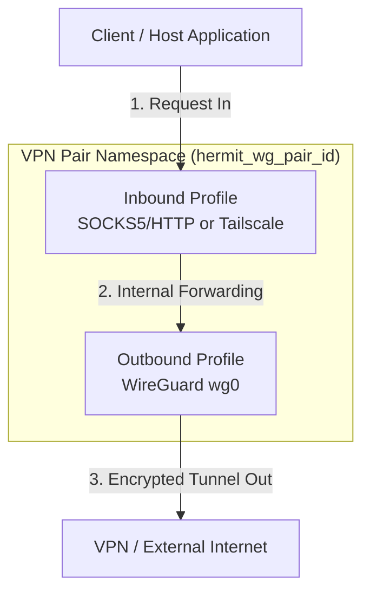
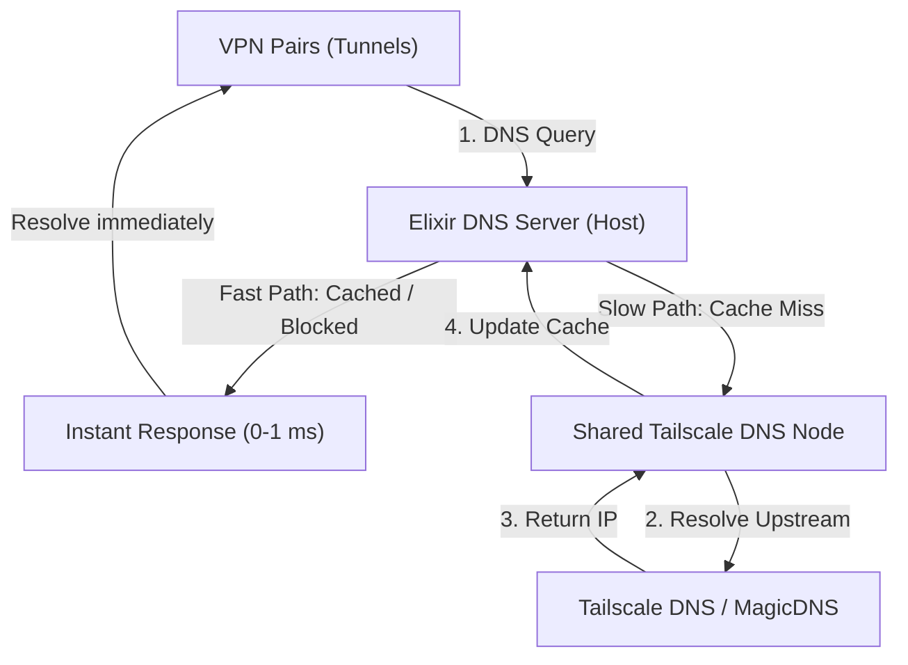

# Hermit

Hermit is a modular multi-tunnel orchestrator and manager for VPN connection pairs running inside isolated network namespaces (`netns`). It decouples configurations into reusable **Inbound Profiles** (e.g., SOCKS5/HTTP Proxy, Tailscale) and **Outbound Profiles** (e.g., WireGuard), allowing you to easily pair, share configurations, and manage multiple tunnels side-by-side.

The application provides a real-time web dashboard to monitor bandwidth usage, manage connection states, create and share profiles, and configure global settings.

> ⚠️ **IMPORTANT NOTE**: This project requires elevated system privileges (`privileged: true`) and advanced networking tools such as `iptables`, `iproute2`, `wireguard-tools`, and `tailscale`. To avoid impacting your host machine's network configuration and to ensure a consistent development environment, **it is highly recommended to develop and run this project completely within Docker**.

---

## Architecture & Network Flow

Hermit uses a decoupled architecture where a VPN tunnel (VPN Pair) is created by combining an **Inbound Profile** with an **Outbound Profile**. The architecture splits system operations into two separate, coordinated planes: the **Traffic Plane** (for normal internet data) and the **DNS Control Plane** (for name resolution and dynamic filtering).

### 1. Traffic Plane (General Data Flow)
This plane manages the encapsulation and transport of regular network traffic (HTTP, TCP/UDP streams) through isolated namespaces.



* **Inbound Profiles**: Define how traffic enters the isolated namespace.
  * **SOCKS5/HTTP Proxy**: Spawns dual proxy daemons (`microsocks` SOCKS5 on 1080, `tinyproxy` HTTP on 8080) inside the namespace, multiplexed via a host-level relayer.
  * **Tailscale**: Binds the namespace to your Tailscale network (tailnet) as an active node.
* **Outbound Profiles**: Define how traffic exits the namespace.
  * **WireGuard**: Interfaces are isolated inside the namespace (`wg0`) to route all outbound data through WireGuard.
* **VPN Pairs**: The orchestrator ties these components together into a single running instance, preventing resource conflicts automatically.

---

### 2. DNS Control Plane (Resolution & Filtering Flow)
This plane intercepts all DNS queries originating from the Traffic Plane namespaces, applies real-time blocklists, and resolves upstream addresses efficiently.

To save CPU and memory, multiple VPN Pairs using the same Inbound Profile **share a single, dedicated DNS Node**, eliminating the need to run heavy `tailscaled` processes or DNS filters inside every single tunnel.



* **Interception**: When a VPN Pair namespace has DNS filtering enabled, its local `resolv.conf` is pointed to `127.0.0.1`. Custom `iptables` rules intercept all port 53 traffic and forward it over a virtual `veth` link to the host.
* **Centralized Filtering (Fast Path vs. Slow Path)**: The Elixir DNS Server on the host evaluates the query to decide the routing:
  * **Fast Path (Blocked or Cached)**: If the query matches any blocklists (AdGuard, GoodbyeAds, Adult content), matches custom redirection rules, or is already present in the shared ETS Cache, the server immediately returns the response to the VPN Pair namespace. This takes 0-1 ms and bypasses the external network entirely.
  * **Slow Path (Upstream Forwarding)**: If the query is a cache miss and is not blocked, it proceeds to upstream resolution.

* **Upstream Forwarding & MagicDNS**: If a query must go upstream:
  * The host DNS server forwards it to the dedicated DNS namespace (`hermit_dns_profile_id`) created for that Inbound Profile.
  * This namespace runs its own `tailscaled` daemon, ensuring private nodes (`MagicDNS`) and tailnet-wide DNS configurations are resolved securely.
  * The shared architecture isolates profiles from each other while keeping resource footprints tiny.

---

## How Traffic and DNS Planes Connect

When you run a VPN Pair, its network namespace is configured as follows:

| Connection Feature | Plane / Mechanism | Network Route |
| :--- | :--- | :--- |
| **Web & API Traffic** | Traffic Plane | Routed directly through the outbound WireGuard (`wg0`) interface. |
| **DNS Queries (Filtered)** | DNS Control Plane | Redirected locally, sent to Host Elixir, checked against blocklists, then resolved through the profile-shared Tailscale DNS node. |
| **DNS Queries (Disabled)** | Traffic Plane | Handled as standard IP packets, resolved directly through external IP resolvers (e.g. Google, Cloudflare) via the active VPN tunnel. |

---

## System Requirements

- **Docker** and **Docker Compose**
- There is no need to install Elixir, Erlang, or SQLite on your host machine as all runtime dependencies are packaged and configured automatically inside the container.

---

## Installation & Quick Start with Docker

To set up the database, fetch dependencies, compile assets, and launch the application, run a single command:

```bash
docker compose up --build
```

Once the container has successfully started, you can access the web interface at:
👉 **[http://localhost:3000](http://localhost:3000)**

Config files and data for your VPN tunnels will persist in the `./storage` directory on your host machine via volume mounts.

### Customizing the Web Port

By default, the dashboard runs on port `3000`. If you need to run it on a different port on your host machine, you can set the `HERMIT_PORT` environment variable before running Docker Compose:

```bash
HERMIT_PORT=8080 docker compose up --build
```

This will map port `8080` on your host machine to port `3000` inside the container, making the dashboard accessible at `http://localhost:8080`.

---

## Development & Testing inside Docker

When developing Hermit, it is recommended to run mix tasks and test suites directly inside the container to ensure correct behavior:

### 1. Run Precommit Checks
Before committing code, run the comprehensive precommit pipeline to format code, check for compiler warnings, and run tests:
```bash
docker compose exec hermit mix precommit
```

### 2. Run Test Suite
To run the project's tests:
```bash
docker compose exec hermit mix test
```

### 3. Fetch Dependencies
If you make changes to `mix.exs`, fetch the updated dependencies within the container:
```bash
docker compose exec hermit mix deps.get
```

---

## Why Docker?

Running real-world VPN pairs requires operating-system level root privileges to create network namespaces (`netns`), configure virtual network interfaces, and route traffic via `iptables`.
- The **`privileged: true`** setting in `docker-compose.yml` grants the container permissions to perform these system-level operations in an isolated manner.
- Running directly on your host machine risks messing up local network interfaces and requires granting global `sudo` privileges to external scripts, which is unsafe for your development environment.

---

## 🗺️ Alternatives & Similar Projects

If you are looking for other tools to manage VPNs or WireGuard tunnels, here is how **Hermit** compares to existing popular open-source alternatives:

| Project | Primary Focus | UI Type | WireGuard Management | Tailscale Integration | Network Namespace Isolation |
| :--- | :--- | :--- | :--- | :--- | :--- |
| **Hermit** | Multi-tunnel orchestrator | Web Dashboard | Yes | Yes | Yes (isolated `netns`) |
| **[wireproxy](https://github.com/octeep/wireproxy)** | Userspace WireGuard proxy | CLI / Config | Yes | No | No (userspace proxy) |
| **[Gluetun](https://github.com/qdm12/gluetun)** | Docker-focused VPN client | CLI / Config | Yes | No | No (uses Docker network links) |

---

## 🤝 Contributing

Contributions are welcome! Please feel free to open issues, submit pull requests, or share ideas to improve Hermit.

---

## 📄 License

This project is licensed under the MIT License - see the [LICENSE](LICENSE) file for details.
