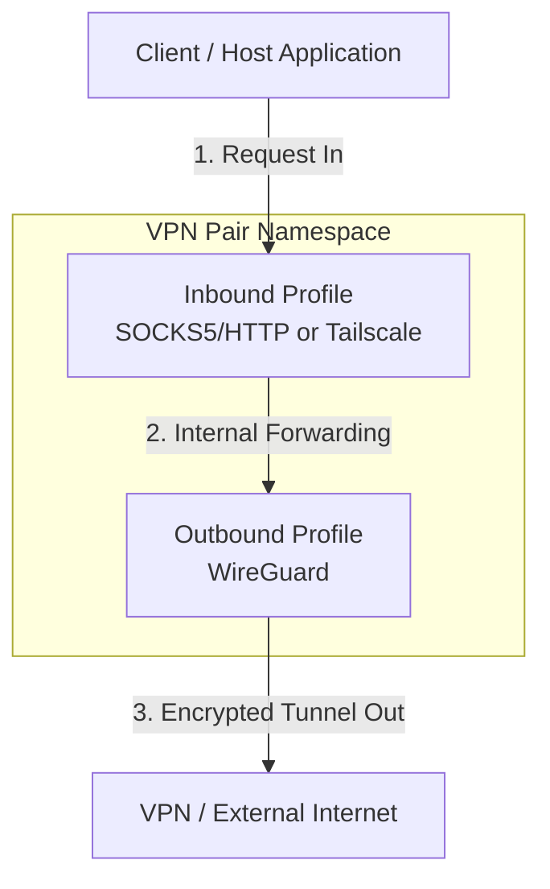
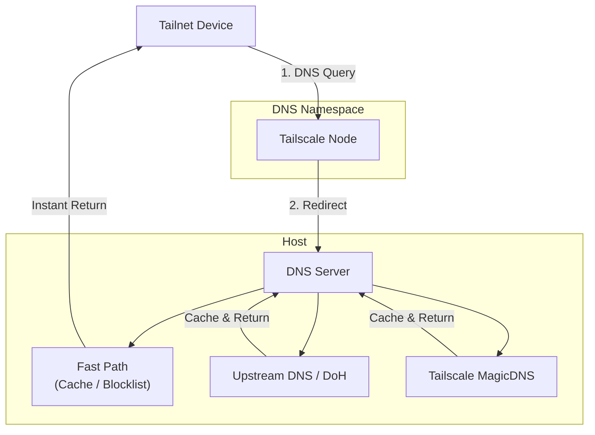

# Hermit

Hermit is a modular multi-tunnel orchestrator and manager for VPN connection pairs running inside isolated network namespaces (`netns`). It decouples configurations into reusable **Inbound Profiles** (e.g., SOCKS5/HTTP Proxy, Tailscale) and **Outbound Profiles** (e.g., WireGuard), allowing you to easily pair, share configurations, and manage multiple tunnels side-by-side.

The application provides a real-time web dashboard to monitor bandwidth usage, manage connection states, create and share profiles, and configure global settings.

> ⚠️ **IMPORTANT NOTE**: This project requires elevated system privileges (`privileged: true`) and advanced networking tools such as `iptables`, `iproute2`, `wireguard-tools`, and `tailscale`. To avoid impacting your host machine's network configuration and to ensure a consistent development environment, **it is highly recommended to develop and run this project completely within Docker**.

---

## Architecture & Network Flow

Hermit creates VPN tunnels by combining an **Inbound Profile** with an **Outbound Profile** inside an isolated Linux network namespace. The architecture is split into two planes:

- **Traffic Plane**: Carries regular network data (HTTP, TCP/UDP) through the tunnel.
- **DNS Control Plane**: Handles name resolution, caching, and ad/tracker filtering independently from the tunnels.

### Traffic Plane



- **Inbound Profiles** define how traffic enters the namespace:
  - **SOCKS5/HTTP Proxy**: Exposes a SOCKS5 and HTTP proxy endpoint for clients to connect to.
  - **Tailscale**: Joins the namespace to your Tailscale network (tailnet) as a node, so any tailnet device can route traffic through it.
- **Outbound Profiles** define how traffic exits the namespace:
  - **WireGuard**: All outbound traffic is routed through a WireGuard tunnel.
- **VPN Pairs**: The orchestrator combines one Inbound + one Outbound into a running instance, handling resource allocation and conflict prevention automatically.

### DNS Control Plane

The DNS plane is decoupled from VPN Pairs. Hermit supports **Multi-Profile Dynamic DNS Filtering**, allowing you to pre-configure multiple DNS Server Profiles and assign them dynamically to your Inbound Profiles.

- **Multiple Pre-configured DNS Profiles**: You can set up multiple DNS Profiles beforehand, each with its own upstream DNS servers (UDP/DoH), custom routing rules (block/bypass/redirect), and toggleable blocklists (AdGuard, GoodbyeAds, adult content).
- **Flexible Association**: Each Inbound Tailscale Profile can be linked to any pre-configured DNS Profile.
- **Automated Node Setup**: When a Tailscale Inbound Profile starts, Hermit automatically provisions and boots a dedicated **DNS Node** (running `tailscaled` in an isolated network namespace `hermit_dns_#{profile_id}`) and its associated Elixir DNS resolver.
- **Automated Global DNS Configuration**: When **Tailscale DNS Override** is enabled, Hermit automatically uses the Tailscale API to register this DNS Node as the global nameserver for your entire tailnet. All devices on your tailnet will use this node automatically without any manual client configuration.



When a DNS query arrives, the server evaluates it through a **fast path** before reaching the network:

1. **Custom Rules**: User-defined block or redirect rules are matched first.
2. **Blocklists**: Checked against built-in ad/tracker blocklists (AdGuard, GoodbyeAds, adult content). Matched domains are blocked instantly.
3. **Cache**: Previously resolved queries are returned from cache.

If none of the above match (cache miss), the query is forwarded to configured **upstream DNS servers** (UDP or DoH). Tailscale internal domains (`*.ts.net`) are resolved via **MagicDNS** automatically.

When **Tailscale DNS Override** is enabled, the DNS Node registers itself as the tailnet-wide DNS server via the Tailscale API, so all devices on the tailnet use it automatically without manual configuration.

---

## System Requirements

- **Docker** and **Docker Compose**
- There is no need to install Elixir, Erlang, or SQLite on your host machine as all runtime dependencies are packaged and configured automatically inside the container.

---

## Installation & Quick Start with Docker

Hermit can be run in two different modes:

### 1. Production Mode (No Clone Required)

```bash
curl -L https://raw.githubusercontent.com/quaywin/hermit/main/docker-compose.yml -o docker-compose.yml
docker compose pull && docker compose up -d
```

If you have already cloned the repository, run `docker compose up -d --build` instead.

Once started, access the dashboard at **http://localhost:3000**.

### 2. Development Mode (Fast & Low CPU)
Mounts the source code directory directly, enabling incremental compilation and hot-code reloading. You do not need to rebuild the Docker image when editing files.
```bash
docker compose -f docker-compose.dev.yml up -d
```
* Modifying source code on the host machine instantly triggers incremental compilation in less than 0.5 seconds.
* Subsequent starts are nearly instantaneous because dependency compilation and build artifacts are cached.

### Customizing the Web Port

By default, the dashboard runs on port `3000`. To use a different port, set `HERMIT_PORT`:

```bash
# Production
HERMIT_PORT=8080 docker compose up -d

# Development
HERMIT_PORT=8080 docker compose -f docker-compose.dev.yml up -d
```

## Why Docker?

Running real-world VPN pairs requires operating-system level root privileges to create network namespaces (`netns`), configure virtual network interfaces, and route traffic via `iptables`.
- The **`privileged: true`** setting in `docker-compose.yml` grants the container permissions to perform these system-level operations in an isolated manner.
- Running directly on your host machine risks messing up local network interfaces and requires granting global `sudo` privileges to external scripts, which is unsafe for your development environment.

---

## 🗺️ Alternatives & Similar Projects

If you are looking for other tools to manage VPNs or WireGuard tunnels, here is how **Hermit** compares to existing popular open-source alternatives:

| Project | Primary Focus | UI Type | WireGuard Management | Tailscale Integration | Network Namespace Isolation |
| :--- | :--- | :--- | :--- | :--- | :--- |
| **Hermit** | Multi-tunnel orchestrator | Web Dashboard | Yes | Yes | Yes (isolated `netns`) |
| **[wireproxy](https://github.com/octeep/wireproxy)** | Userspace WireGuard proxy | CLI / Config | Yes | No | No (userspace proxy) |
| **[Gluetun](https://github.com/qdm12/gluetun)** | Docker-focused VPN client | CLI / Config | Yes | No | No (uses Docker network links) |

---

## 🤝 Contributing

Contributions are welcome! Please feel free to open issues, submit pull requests, or share ideas to improve Hermit.

---

## 📄 License

This project is licensed under the MIT License - see the [LICENSE](LICENSE) file for details.
