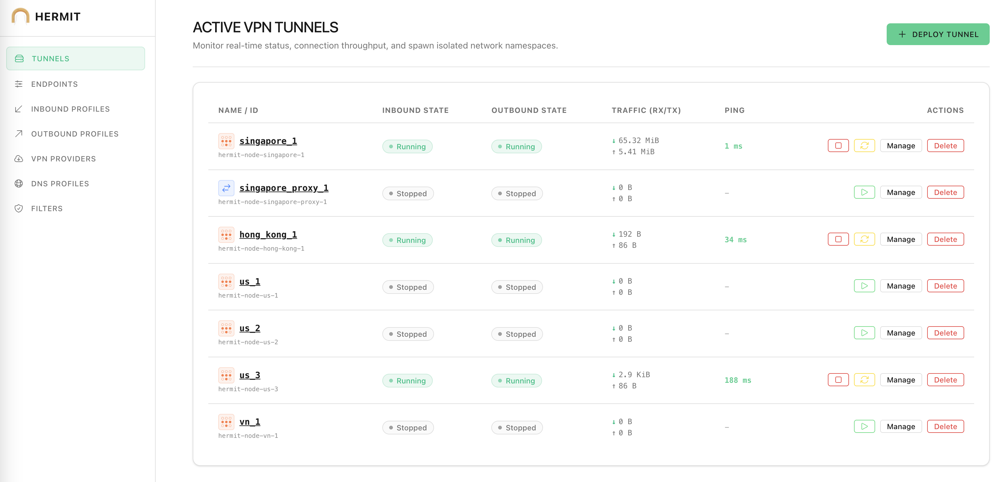
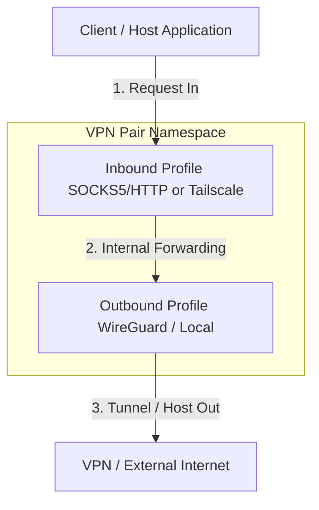
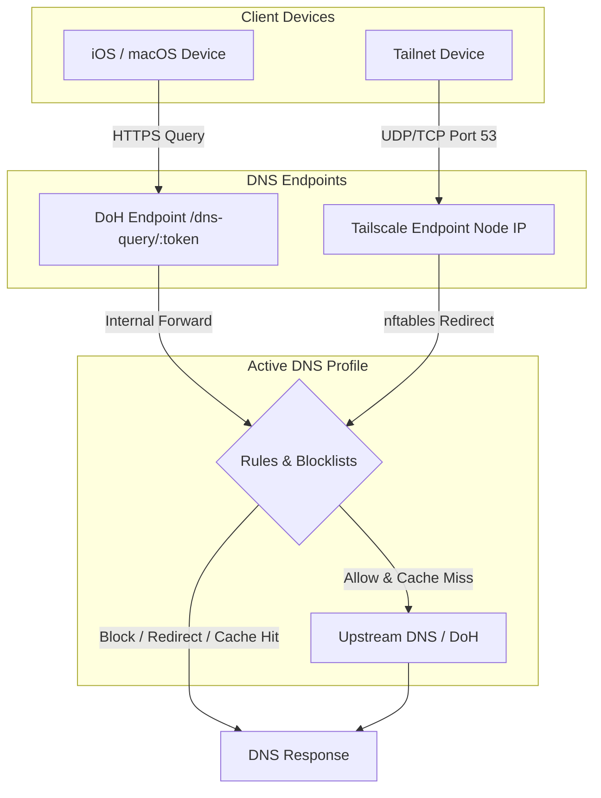

<h1 align="center">
   Hermit
</h1>

<p align="center">
  A modular multi-tunnel orchestrator and manager for VPN connection pairs running inside isolated network namespaces (<code>netns</code>).
</p>

<p align="center">
  <a href="https://github.com/quaywin/hermit/blob/main/LICENSE"></a>
  <a href="https://elixir-lang.org"></a>
  <a href="https://phoenixframework.org"></a>
</p>

<p align="center">
  
</p>

---

Hermit is a modular multi-tunnel orchestrator and manager for VPN connection pairs running inside isolated network namespaces (`netns`). It decouples configurations into reusable **Inbound Profiles** (e.g., SOCKS5/HTTP Proxy, Tailscale) and **Outbound Profiles** (e.g., WireGuard, Local), allowing you to easily pair, share configurations, and manage multiple tunnels side-by-side.

The application provides a real-time web dashboard to monitor bandwidth usage, manage connection states, create and share profiles, and configure global settings.

> [!IMPORTANT]
> This project requires elevated system privileges (`privileged: true`) and advanced networking tools such as `nftables`, `iproute2`, `wireguard-tools`, and `tailscale`. To avoid impacting your host machine's network configuration and to ensure a consistent development environment, **it is highly recommended to develop and run this project completely within Docker**.

---

## Key Features

- **Multi-Tunnel Orchestration**: Pair inbound (SOCKS5/HTTP Proxy, Tailscale) with outbound (WireGuard, Local) profiles to run multiple independent tunnels side-by-side.
- **Isolated Network Namespaces**: Run each connection pair in its own Linux network namespace (`netns`) with dynamic source-policy routing to prevent routing conflicts.
- **Decoupled DNS Control Plane**: A DNS filtering system with bloom filters, caching, dynamic blocklist loading (AdGuard, GoodbyeAds, adult content), and custom DNS routing rules (Block, Bypass, Redirect, Forward Proxy, Forward DNS).
- **DNS Endpoints (DoH / VPN Nodes)**: Expose secure DNS-over-HTTPS (DoH) endpoints with auto-generated Apple Configuration Profiles (`.mobileconfig`) or dedicated Tailscale DNS Nodes.
- **Tailscale DNS Override**: Automatically registers local DNS Nodes as tailnet-wide nameservers.
- **EDNS Client Subnet (ECS)**: Forward client subnet masks to public upstreams (e.g. Google DNS) to optimize CDN routing, with support for LAN privacy filtering and custom fallback IPs.
- **VPN Providers Integration**: Direct authentication with NordVPN (using Access Tokens) and Mullvad to fetch recommendations, network speed profiles, and public keys.
- **Real-Time Web Dashboard**: A Phoenix LiveView dashboard to monitor bandwidth, manage tunnel states, view query logs, and edit configurations on the fly.

---

## Architecture & Network Flow

Hermit creates VPN tunnels by combining an **Inbound Profile** with an **Outbound Profile** inside an isolated Linux network namespace. The architecture is split into two planes:

- **Traffic Plane**: Carries regular network data (HTTP, TCP/UDP) through the tunnel.
- **DNS Control Plane**: Handles name resolution, caching, and ad/tracker filtering independently from the tunnels.

### Traffic Plane


```mermaid
flowchart TD
    Client[Client / Host Application] -->|1. Request In| Inbound[Inbound Profile SOCKS5/HTTP or Tailscale]
    subgraph NetNS [VPN Pair Namespace]
        Inbound -->|2. Internal Forwarding| Outbound[Outbound Profile WireGuard / Local]
    end
    Outbound -->|3. Tunnel / Host Out| Internet[VPN / External Internet]
```

- **Inbound Profiles** define how traffic enters the namespace:
  - **SOCKS5/HTTP Proxy**: Exposes SOCKS5 and HTTP proxy endpoints for clients to connect to.
  - **Tailscale**: Joins the namespace to your Tailscale network (tailnet) as a node, allowing any tailnet device to route traffic through it.
- **Outbound Profiles** define how traffic exits the namespace:
  - **WireGuard**: All outbound traffic is routed through a WireGuard tunnel.
  - **Local**: Bypasses VPN tunnels and routes traffic directly through the host network interface (useful for testing, local proxies, or selective routing).
- **VPN Pairs**: The orchestrator combines one Inbound + one Outbound into a running instance, handling resource allocation and conflict prevention automatically.

### DNS Control Plane

The DNS plane is fully decoupled from VPN Pairs and Inbound Networks. Hermit supports **DNS Endpoints** and **DNS Profiles** to separate network connection endpoints from routing/filtering logic:

- **DNS Profiles**: Pre-configure multiple DNS Profiles, each with its own upstream DNS servers (UDP/DoH), custom routing rules (block/bypass/redirect), and toggleable blocklists.
- **DNS Endpoints (DoH / VPN Nodes)**: Expose access points for your devices. You can create multiple Endpoints:
  - **DoH Only (Default / Lightweight)**: Runs entirely in-memory using the Phoenix HTTP/HTTPS web port, using 0% extra CPU/RAM. Provides a secure HTTPS DoH URL (`/dns-query/:token`) and automatically generates signed Apple configuration profiles (`.mobileconfig`).
  - **Tailscale Integration (Optional)**: Link your DNS Endpoint to any Tailscale Inbound Profile. When active, Hermit boots a dedicated **DNS Node** (`tailscaled` inside a network namespace `hermit_dns_endpoint_#{id}`) on your tailnet, allowing client devices to resolve DNS over UDP/TCP 53.
- **Automated Global DNS Configuration**: When **Tailscale DNS Override** is enabled on a Tailscale Endpoint, Hermit registers the local DNS Node IP as the global nameserver for your entire tailnet. All devices on your tailnet will use this node automatically without manual client configuration.


```mermaid
flowchart TD
    subgraph Clients [Client Devices]
        AppleDev[iOS / macOS Device]
        TailnetDev[Tailnet Device]
    end

    subgraph Endpoints [DNS Endpoints]
        DoHEndpoint[DoH Endpoint /dns-query/:token]
        TSEndpoint[Tailscale Endpoint Node IP]
    end

    subgraph Profile [Active DNS Profile]
        Rules{Rules & Blocklists}
        Upstream[Upstream DNS / DoH]
    end

    %% Queries to Endpoints
    AppleDev -->|HTTPS Query| DoHEndpoint
    TailnetDev -->|UDP/TCP Port 53| TSEndpoint

    %% Endpoints routing to active profile
    DoHEndpoint -->|Internal Forward| Rules
    TSEndpoint -->|nftables Redirect| Rules

    %% Profile Resolution
    Rules -->|Allow & Cache Miss| Upstream
    Rules -->|Block / Redirect / Cache Hit| Respond[DNS Response]
    Upstream --> Respond
```

When a DNS query arrives, the server evaluates it through a **fast path** before reaching the network:

1. **Custom Rules**: User-defined routing rules are matched first. Actions include:
   - **Block**: Instantly block matching domains (NXDOMAIN).
   - **Bypass**: Bypass ad/tracker blocklist filters.
   - **Redirect**: Resolve domain to a specific target IP address (A record).
   - **Forward Proxy**: Proxy the DNS query through the proxy tunnel of a selected VPN pair.
   - **Forward DNS**: Forward the DNS query to a specific DNS Server (UDP/DoH), optionally routed through the SOCKS5/HTTP proxy of a selected VPN pair.
2. **Blocklists**: Checked against built-in ad/tracker blocklists (AdGuard, GoodbyeAds, adult content). Matched domains are blocked instantly.
3. **Cache**: Previously resolved queries are returned from cache.

If none of the above match (cache miss), the query is forwarded to configured **upstream DNS servers** (UDP or DoH).

### DNS-over-HTTPS (DoH) & Apple Device Provisioning

In addition to Tailscale integration, Hermit includes a built-in **DNS-over-HTTPS (DoH)** server. This allows any device (even those not on your Tailnet) to use your secure, filtered DNS configurations.
- **Secure DoH Endpoint**: Each DNS Endpoint is assigned a unique token, exposing a secure DoH resolver endpoint at `https://<your-host>/dns-query/<doh_token>`.
- **Apple Configuration Profiles (`.mobileconfig`)**: Hermit can dynamically generate Apple configuration profiles for iOS and macOS. Users can download these profiles from the dashboard to configure system-wide secure DNS with zero manual setup. All profile descriptions match your custom Endpoint names.

### EDNS Client Subnet (ECS) & Subnet Spoofing

Hermit supports **EDNS Client Subnet (ECS, RFC 7871)** to optimize CDN routing (e.g. YouTube, Netflix, Facebook) by forwarding the client's subnet mask (IPv4 `/24` or IPv6 `/48`) to public upstream DNS servers.
- **Smart Client Subnet Forwarding**: For public client IPs (e.g. via DoH), Hermit forwards the subnet directly. For private client IPs (e.g. loopback, LAN, or Tailscale CGNAT `100.64.0.0/10`), Hermit skips ECS injection automatically to protect client privacy.
- **ECS Fallback IP**: You can configure a public IP address as the fallback. When a request originates from a private Tailscale IP, Hermit will inject the fallback IP subnet instead, ensuring you always resolve CDN traffic to your target country.

---

## VPN Provider Integration

To simplify creating Outbound Profiles, Hermit provides a dedicated **Providers** page (`/providers`) that integrates with popular commercial VPN providers:
- **NordVPN**: Authenticate using a NordVPN Access Token to retrieve your private key, list recommended countries, and import recommended WireGuard server configurations.
- **Mullvad**: Fetch active Mullvad WireGuard servers with country/city metadata, network speeds, and public keys.
- **Custom Imports**: Easily upload or paste custom WireGuard configuration files to generate new Outbound Profiles in one click.

---

## System Requirements

- **Docker** and **Docker Compose**

> [!NOTE]
> There is no need to install Elixir, Erlang, or SQLite on your host machine as all runtime dependencies are packaged and configured automatically inside the container.

---

## Installation & Quick Start with Docker

Hermit is packaged as an all-in-one, multi-arch Docker image supporting both **x86_64 (`amd64`)** and **ARM64 (`arm64`)** architectures (Intel, AMD, Apple Silicon, AWS Graviton, Oracle Cloud ARM, etc.).

---

### 1. Production Mode (Quick 1-Line Installer)

We recommend using our automated installer. It automatically prepares `~/.hermit/storage`, generates cryptographically strong `SECRET_KEY_BASE` and random Web Dashboard credentials, detects available ports to prevent conflicts, and provides zero-configuration setup:

```bash
curl -fsSL https://raw.githubusercontent.com/quaywin/hermit/main/install.sh | bash
```

Once installed, the installer outputs your access details:
* **Web Dashboard**: `http://localhost:3000` (or `http://<your-vps-ip>:3000`)
* **Default Username**: `admin`
* **Password**: *Randomly generated and displayed in terminal summary (saved at `~/.hermit/env`)*

---

### 2. Upgrading Hermit

Hermit supports two frictionless upgrade methods without losing any tunnel configurations or database records:

* **1-Click Web Upgrade (Zero Terminal)**:
  Navigate to **Settings** (`/settings`) on the web dashboard. When a new release is available on GitHub, an update banner will appear. Simply click **[Upgrade]** — Hermit will pull the latest Docker image and restart the container seamlessly in ~10 seconds.
* **Terminal 1-Line Upgrade**:
  Re-run the installer script on your server at any time. It automatically recognizes your existing installation (`~/.hermit/env`), preserves all data, and updates to the latest release:
  ```bash
  curl -fsSL https://raw.githubusercontent.com/quaywin/hermit/main/install.sh | bash
  # or simply:
  hermit update
  ```

---

### 3. Quick Management via `hermit` CLI

The installer creates a global `hermit` shortcut command on your server for effortless day-to-day operations:

```bash
hermit status    # View container status and port mappings
hermit logs      # Follow live container logs
hermit restart   # Restart Hermit container
hermit update    # Pull latest image and upgrade
hermit env       # View credentials and configuration
```

---

### 4. Manual Installation (Without `install.sh`)

If you prefer to configure Docker Compose manually without the installer script:

```bash
# 1. Create config & storage directory
mkdir -p ~/.hermit/storage

# 2. Generate environment secrets
cat <<EOF > ~/.hermit/env
SECRET_KEY_BASE=$(openssl rand -base64 48 | tr -d '\n')
PHX_HOST=localhost
HERMIT_PORT=3000
HERMIT_BASIC_AUTH_USER=admin
HERMIT_BASIC_AUTH_PASS=$(openssl rand -hex 6)
EOF

# 3. Download docker-compose configuration
curl -fsSL https://raw.githubusercontent.com/quaywin/hermit/main/docker-compose.yml -o ~/.hermit/docker-compose.yml

# 4. Start Hermit
docker compose -f ~/.hermit/docker-compose.yml up -d
```

---

### 5. Development Mode

Mounts the source code directly with live code reloading and incremental compilation in `< 0.5s`:

```bash
docker compose -f docker-compose.dev.yml up -d
```

---

### 6. Deploying to Cloud (Fly.io)

Hermit can be deployed seamlessly to [Fly.io](https://fly.io) MicroVMs with persistent storage and **512MB Swap** safety buffer ($0/month under free credit allowance). See the detailed [Fly.io Deployment Guide](docs/FLY_DEPLOYMENT.md) for full setup instructions.

```bash
# Quick Launch on Fly.io
fly launch --no-deploy
fly volumes create hermit_data --size 1 --region sin
fly secrets set PHX_HOST="your-app.fly.dev" SECRET_KEY_BASE=$(openssl rand -base64 48)
fly scale memory 512
fly deploy
```

---

### 7. Port Reference & Firewall Configuration

When running in standard Production Mode (`network_mode: host`):

| Port / Protocol | Service | Description |
| :--- | :--- | :--- |
| **`3000/tcp`** | Web Dashboard | Phoenix LiveView Web UI (Customizable via `HERMIT_PORT` in `~/.hermit/env`). |
| **`Dynamic UDP`** | Tailscale Inbounds | **Zero-configuration**: Kernel automatically allocates free ephemeral ports for 100% Direct P2P. |
| **`53/udp, tcp`** | Standalone DNS | Port 53 DNS resolver (optional if using Hermit as LAN DNS server). |

> [!TIP]
> **Co-existing with Host Tailscale & Services**:
> In host mode, each VPN tunnel runs in an isolated Linux network namespace (`netns`). It will **never conflict** with your host's Tailscale daemon (`41641/udp`) or drop your SSH connection.

#### Customizing the Web Port
To use a custom web port, set `HERMIT_PORT` in `~/.hermit/env` (e.g. `HERMIT_PORT=8080`) and restart with `hermit restart`.

#### Enforcing Web Authentication (Basic Auth)
Basic Authentication is enabled automatically by `install.sh`. You can adjust credentials anytime in `~/.hermit/env`:
```bash
HERMIT_BASIC_AUTH_USER=admin
HERMIT_BASIC_AUTH_PASS=your_secure_password
```

#### Tailscale Performance Optimization (Highly Recommended)

Hermit implements high-performance network tuning for Tailscale:
- **Namespace UDP GRO Offloading**: Hermit automatically runs `ethtool` to enable `rx-udp-gro-forwarding` and disable `rx-gro-list` on all virtual interfaces inside the isolated network namespaces.

**Host-level Optimization (Manual):**
Because Hermit runs in an isolated network namespace, it does not modify the host's physical network hardware directly. To get the maximum throughput:
1. Ensure your host system runs Linux Kernel **6.2** or later.
2. Manually enable UDP GRO on your host's primary physical network interface (this single-line command auto-detects the interface and works on all shells including Bash, Zsh, and Fish):
   ```bash
   sudo sh -c 'ethtool -K $(ip -o route get 8.8.8.8 | cut -f 5 -d " ") rx-udp-gro-forwarding on rx-gro-list off'
   ```

---

## Why Docker?

Running real-world VPN pairs requires operating-system level root privileges to create network namespaces (`netns`), configure virtual network interfaces, and route traffic via `nftables`.
- The **`privileged: true`** setting in `docker-compose.yml` grants the container permissions to perform these system-level operations in an isolated manner.
- Running inside Docker prevents impacting your host machine's network configuration, avoids dependency conflicts, and ensures an easy 1-line installation and upgrade experience.

---

## Future Roadmap

We aim to continuously improve Hermit. Planned future enhancements include:
- **Expanded VPN Provider Integration**: Add support for more commercial VPN providers (such as Surfshark, ProtonVPN, and ExpressVPN) to fetch keys, server recommendations, and network speed profiles automatically.
- **Alternative Inbound Mesh Networks**: Integrate additional Tailscale-like overlay networks (e.g., **ZeroTier**, **Netmaker**, **Headscale**, or **Nebula**) as Inbound Profiles, allowing client devices on those networks to route traffic through your outbound tunnels.

---

## Alternatives & Similar Projects

If you are looking for other tools to manage VPNs or WireGuard tunnels, here is how **Hermit** compares to existing popular open-source alternatives:

| Project | Primary Focus | UI Type | WireGuard Management | Tailscale Integration | Network Namespace Isolation |
| :--- | :--- | :--- | :--- | :--- | :--- |
| **Hermit** | Multi-tunnel orchestrator | Web Dashboard | Yes | Yes | Yes (isolated `netns`) |
| **[wireproxy](https://github.com/octeep/wireproxy)** | Userspace WireGuard proxy | CLI / Config | Yes | No | No (userspace proxy) |
| **[Gluetun](https://github.com/qdm12/gluetun)** | Docker-focused VPN client | CLI / Config | Yes | No | No (uses Docker network links) |

---

## Inspiration & Origins

The development of **Hermit** was shaped by a few core ideas and existing tools:

* **Tailscale Exit Nodes + Mullvad VPN**: The initial spark came from wanting a clean way to combine the ease of Tailscale’s mesh networking with the privacy of Mullvad VPN. The goal was to dynamically route traffic from Tailscale devices through isolated Mullvad WireGuard tunnels.
* **Self-hosted DNS inside Tailnet**: Instead of relying on external DNS services, the author set out to run a dedicated DNS Resolver node directly inside the Tailnet. The early Erlang/Elixir DNS implementation was built with reference to the **`dns_erlang`** specification and Kip Cole's **[dns](https://github.com/kipcole9/dns)** library.
* **Evolution into a Control D Alternative**: Once a basic DNS server was operational inside the Tailnet, we saw the potential of dynamic, multi-tenant DNS routing. Inspired by the architecture of commercial services like **Control D**, Hermit evolved to support multiple isolated **DNS Endpoints** (each with dedicated DoH tokens or Tailscale Node IPs) mapped to custom **DNS Profiles** (blocking, bypassing, or redirecting domains through specific VPN Pairs).

---

## Acknowledgments & Credits

Hermit is built on top of and inspired by several amazing open-source projects:

* **[WireGuard](https://www.wireguard.com/)** - For the extremely fast, modern, and secure VPN protocol.
* **[Tailscale](https://tailscale.com/)** - For making private networking easy and secure.
* **[AdGuard Home](https://github.com/AdguardTeam/AdGuardHome)** & **[GoodbyeAds](https://github.com/jerryn70/GoodbyeAds)** - For providing the blocklists that power our DNS control plane.
* **[dns](https://github.com/kipcole9/dns)** - The Elixir DNS library that helped shape our query parser and packet builder.
* **Elixir & Phoenix LiveView** - For enabling a real-time system dashboard with minimal overhead.
